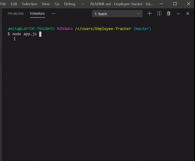
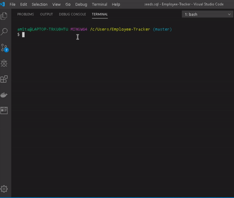
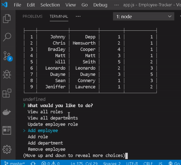

# Template Engine - Employee Summary

A command line application that can be used to manage employee powered by MySQL database, Node.js with  inquirer.

This command-line application can do the followings:

  * Add departments, roles, employees

  * View departments, roles, employees

  * Update employee roles  

  * View employees by manager

  * Delete departments, roles, and employees

  * View the total utilized budget of a `department` -- ie the combined salaries of all employees in that department
  * View the total utilized budget of a `manager` -- ie the combined salaries of all employees in that department


## Usage demo utilized budget



## Usage demo View



## Usage demo add



## Table of Contents


## Description

The Employee Recording Program helps someone in an administrative position to easily log new employees, view existing employees, and update them as well

## Features

- When you run the program, in the command line interface you have 10 options to modify the SQL table: Add, View, and Delete for tables the tables named role, department, and employees; also, there is an option to update rolls.
- When Add is selected the user will be asked what role, department, or name they would like to add. If the user chose View for whichever table, the console will bring back an organized listing of the table. If Delete is selected the user will be prompted enter the name of the employee to be deleted.
- When update role is selected the user will be asked for the role to modified. Rerunning SELECT * FROM (table) will display the modified table depending on which option was previously selected. 

## Getting-Started

The application will be invoked with the following command post database/sql is eatablished: 

```
node app.js.
npm i

```

## DB Structure:

* **department**:

  * **id** - INT PRIMARY KEY
  * **name** - VARCHAR(30) to hold department name

* **role**:

  * **id** - INT PRIMARY KEY
  * **title** -  VARCHAR(30) to hold role title
  * **salary** -  DECIMAL to hold role salary
  * **department_id** -  INT to hold reference to department role belongs to

* **employee**:

  * **id** - INT PRIMARY KEY
  * **first_name** - VARCHAR(30) to hold employee first name
  * **last_name** - VARCHAR(30) to hold employee last name
  * **role_id** - INT to hold reference to role employee has
  * **manager_id** - INT to hold reference to another employee that manager of the current employee. This field may be null if the employee has no manager

  


